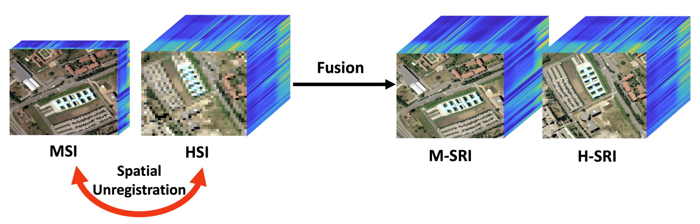
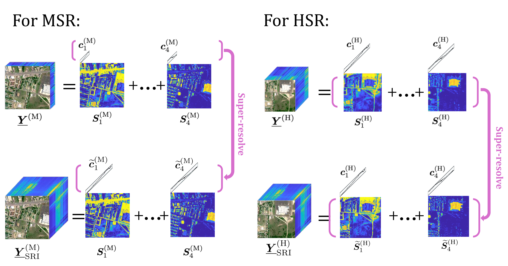
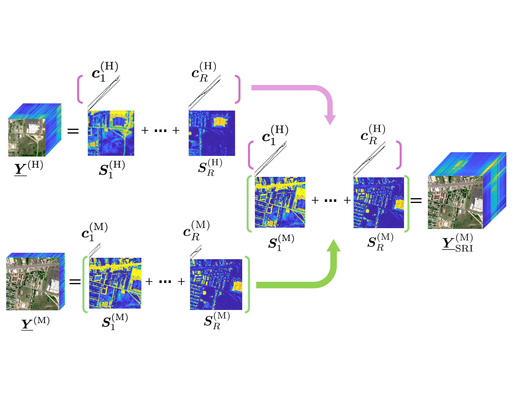
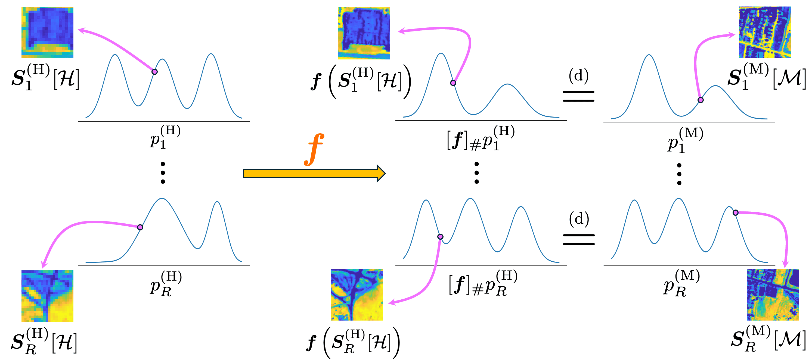
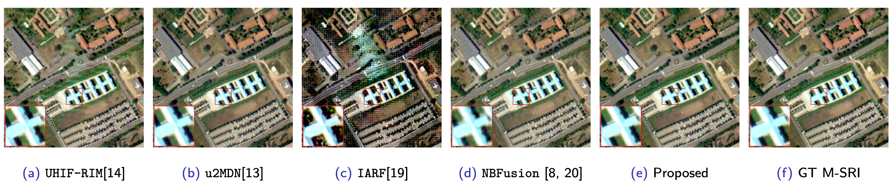
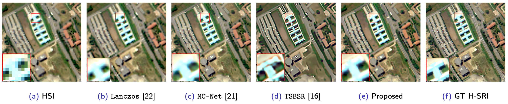
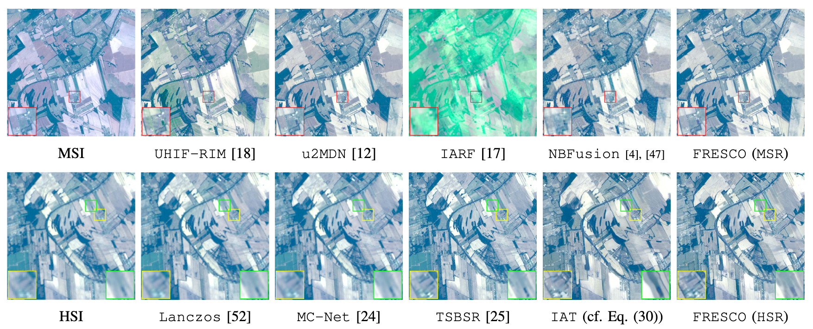

## **FRESCO**: **F**actorized **R**epresentation for **E**nhanced **S**uper-resolution using latent **C**omponent-adversarial **O**ptimization

<p align="center">
  
</p>

This repository corresponds to the paper:

> **Unregistered Spectral Image Fusion: Unmixing, Adversarial Learning, and Recoverability** Jiahui Song, Sagar Shrestha, Xiao Fu  

<p>
  <a href="https://arxiv.org/abs/2603.21510">
    <b>[ arXiv ]</b>
  </a>
</p>

## Overview

**FRESCO** addresses the unregistered hyperspectral and multispectral image fusion problem using a two-stage framework:

<p align="center">
  
</p>

### MSR stage 
>Coupled spectral unmixing to recover the M-SRI.

<p align="center">
  
</p>

### HSR stage 
>Latent-space adversarial learning to recover the H-SRI by matching abundance patch distributions.

<p align="center">
  
</p>


The method does not require **paired training data** or **spatial co-registration**.


## Reproduce the Experiment

### 1. Installation

The algorithm was implemented with **Python 3.12.8**. Please install the dependencies as follows:

```bash
conda create -n fresco python=3.12.8
conda activate fresco
pip install -r requirements.txt
```

### 2. Data Preparation

(1) Download the dataset from the link: [DatasetLink].

(2) After downloading, unzip the dataset and place it under the `data/` folder.


### 3. Run the Code

Activate the environment and run the corresponding experiment script. For example, to reproduce the experiment on the **Pavia University** dataset with **Gaussian-kernel downsampling**, run:

```bash
conda activate fresco
bash scripts/pavia_gaussian.sh
```

## Semi-real Experiments

### MSR Results

<p align="center">
  
</p>

### HSR Results

<p align="center">
  
</p>


## Real Applications

<p align="center">
  
</p>


## Citation
If you use this work, please cite:

```
@article{song2026unregistered,
  title={Unregistered spectral image fusion: Unmixing, adversarial learning, and recoverability},
  author={Song, Jiahui and Shrestha, Sagar and Fu, Xiao},
  journal={arXiv preprint arXiv:2603.21510},
  year={2026}
}
```
